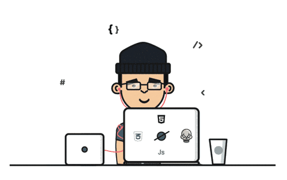
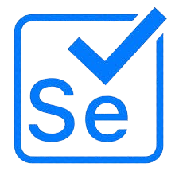
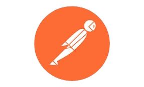
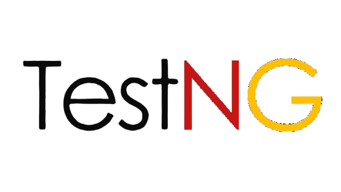

<h1 align="center">Hi , I'm Lavan Andhavarapu </h2> </h1> 
<h3 align="center">| CODER | TESTER | SELF-LEARNER |</h3>

  •  
   •   
  

###  A little more about me...  

- 🔭 I’m currently working as **Consultant @ Genpact**

- I have hands-on experience in testing **Loan IQ** projects, leveraging my skills to ensure high-quality deliverables and mitigate risks.

- 👨‍💻 All of my projects are available at [https://github.com/Lavan-01](https://github.com/Lavan-01)

- 📫 How to reach me [E-mail](lavanandhavarapu0607@gmail.com)

<h3 align="left">Connect with me:</h3>

  
  

<h3 align="left">Languages and Tools:</h3>

 

   
   
   
   
   
   
   
   

 <em><b>I love connecting with different people</b> so if you want to say <b>hi, I'll be happy to meet you more!</b> 😊</em>

<h3>🎁 My Stats</h3>

  

 

 
  

<h3 align="center"> What i Love ❤️</h3>

|  |  | 
| :---: | :---: |
| <b>Coding</b> | <b>Cricket</b> |
  

<h4 align="center">Show ❤️ By Starring My <a href='https://github.com/Lavan-01?tab=repositories'> Repositories</a></h4>

⭐️ From [Lavan-01](https://github.com/Lavan-01)

